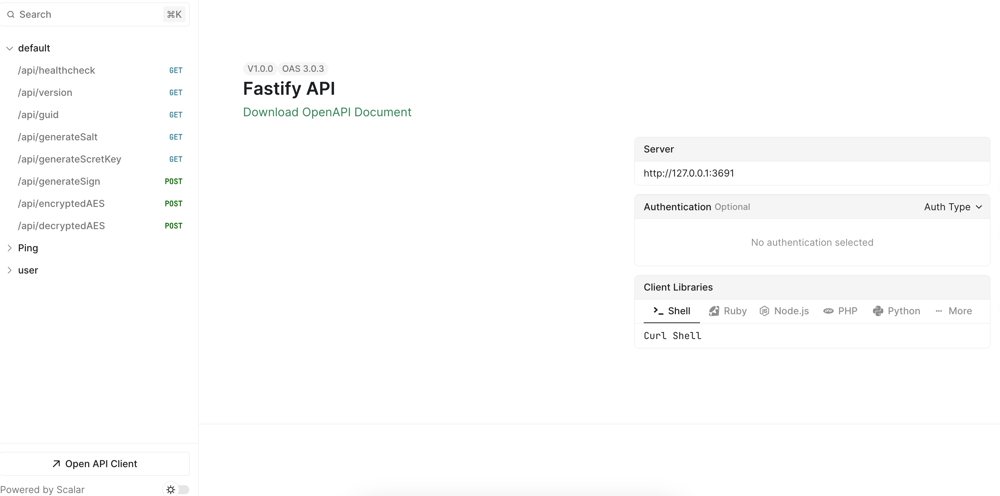
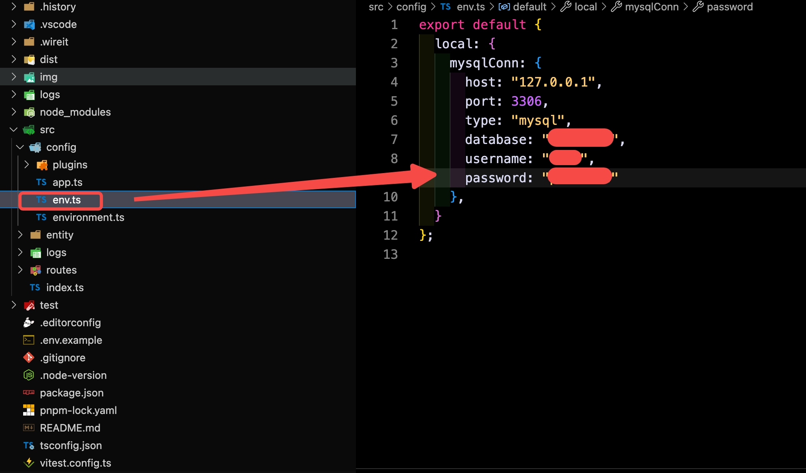

# 🚀 fastify-template-server

fastify api server (the project inspiration comes from [fastify-ts-starter](https://github.com/DouglasdeMoura/fastify-ts-starter))



## 🔥 Pre operational conditions

- be ready to [nodejs](https://nodejs.org/dist/latest/ "nodejs")
- be ready to mysql
- modify database related information



## 💡 Prepare the user table, it's just a demo

```sql
CREATE TABLE `user` (
    `id` int NOT NULL AUTO_INCREMENT,
    `username` varchar(255) NOT NULL,
    `pwd` varchar(255) NOT NULL,
    `salt` varchar(255) NOT NULL,
    `email` varchar(255) NOT NULL,
    `deletedAt` timestamp NULL DEFAULT NULL,
    `createdAt` timestamp NULL DEFAULT CURRENT_TIMESTAMP,
    `updatedAt` timestamp NULL DEFAULT CURRENT_TIMESTAMP,
    PRIMARY KEY (`id`)
)  
```

## 🌈 Install dependency packages

```bash
pnpm i
```

## 🌟 Local packaging

```bash
pnpm run build
```

## 🎉 Run locally

```bash
pnpm run start
```

## 🏆 API

### 1. Get version

* HTTP method: `GET`

* Request URL: `http://[domain]/api/version`

* Response parameters:

| parameters          | subparameters | type     | description                                                          |
| :-----------------: | :-----------: | :------: | -------------------------------------------------------------------- |
| statuscode          | -             | int      | Status code 200 indicates success, non 200 indicates failure         |
| message             | -             | string   | Reminder information                                                 |
| data                | -             | string   | Return results                                                       |

* Response example：
    ```json
    {
      "statuscode": 200,
      "message": "success",
      "data": "v1.0.0"
    }
    ```

